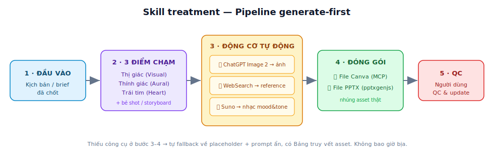

# 🎬 ColorMedia Skills — Claude Code Marketplace

> Bộ skill sản xuất phim của **ColorMedia / MMCorp** cho [Claude Code](https://claude.com/claude-code).
> Skill đầu tiên: **`treatment`** — Kiến trúc & dựng hồ sơ Treatment đạo diễn (v1.3, *generate-first*).

  

---

## TL;DR — cài trong 30 giây

```
/plugin marketplace add aicolormedia-dev/colormedia-skills
/plugin install colormedia@colormedia-skills
```
Khởi động lại Claude Code → gõ `/colormedia:treatment`, hoặc chỉ cần nói *"tạo treatment cho dự án này"* và đính kèm kịch bản — Claude sẽ tự gọi skill.

> ⚠️ Repo trên GitHub chỉ là **nguồn cài**. Phải chạy `/plugin install` ở trên thì skill mới xuất hiện trong Claude Code. Cài xong **phải restart** phiên.

---

## Skill `treatment` làm gì?

Biến **kịch bản/brief đã chốt** thành **hồ sơ Treatment đạo diễn hoàn chỉnh** — gửi khách để bán *niềm tin rằng phim sẽ ra đúng như họ hình dung*.

Điểm khác biệt v1.3 — **GENERATE-FIRST**: skill không dừng ở "tạo khung + để placeholder cho bạn tự điền". Agent **chủ động tạo asset thật** rồi ráp thẳng vào file:

| Bước | Agent tự làm | Công cụ |
|---|---|---|
| 🖼️ Ảnh reference, keyvisual, storyboard | Tạo theo **góc nhìn Đạo diễn & DOP** (shot size, góc máy, lens, chuyển động, ánh sáng, grading) | **ChatGPT Image 2** qua Claude-in-Chrome |
| 🎥 Reference góc máy / chuyển động máy / Color Palette | Chủ động tìm & chèn, có ghi nguồn | **WebSearch + Chrome** |
| 🎵 Nhạc theo Mood & Tone | Tạo 1–2 phương án theo cấu trúc act | **Suno** qua Claude-in-Chrome |
| 📑 Đóng gói | Ráp **1 file Canva + 1 file PPTX** nhúng asset thật | **Canva MCP** + **pptxgenjs** |

➡️ **Người dùng chỉ QC & update.** Cuối phiên có **Bảng truy vết asset** (cái gì auto / cái gì cần tự làm).

Toàn bộ cấu trúc bám **Nguyên lý 3 Điểm Chạm** của ColorMedia: **Thị giác – Thính giác – Trái tim** — đồng trục với khâu QC sau nghiệm thu.

### Pipeline



---

## Khi nào dùng / không dùng

✅ **Dùng khi:** làm treatment, dựng treatment đạo diễn, director treatment, treatment TVC / phim doanh nghiệp / brand film, proposal có storyboard, đóng gói kịch bản đã chốt thành hồ sơ hình ảnh gửi khách.

🚫 **Không dùng để:** viết kịch bản mới (→ skill `corporate-scriptwriting`), tìm insight/big idea (→ skill `insight-first`), hay QC video đã quay (→ skill `videoqc-os`).

---

## Yêu cầu môi trường (Prerequisites)

Skill chạy theo nguyên tắc **graceful fallback** — thiếu công cụ nào thì phần đó tự lùi về chế độ thủ công (placeholder + prompt ẩn) và **báo rõ**, không bao giờ bịa asset.

| Để dùng được | Cần | Nếu thiếu → fallback |
|---|---|---|
| Tạo ảnh tự động | Extension **Claude in Chrome** + tab **ChatGPT Plus** (có Image 2) đã đăng nhập | Sinh prompt ẩn + ô placeholder để bạn tự tạo ảnh |
| Tạo nhạc tự động | Tab **Suno** đã đăng nhập | Mô tả hướng nhạc + ô link reference |
| File Canva | **Canva MCP** đã kết nối/uỷ quyền | Xuất outline để bạn tự paste vào Canva |
| File PPTX | **Node.js** (cho pptxgenjs) | — (hầu như luôn dựng được) |
| Tìm reference | Kết nối mạng | Ô link + QR |

> Không có gì trong số trên cũng vẫn chạy được — bạn nhận về bộ khung treatment + prompt để tự hoàn thiện. Có đủ thì gần như tự động hoàn toàn.

---

## 📚 Tài liệu

| File | Nội dung |
|---|---|
| [docs/USAGE.md](docs/USAGE.md) | Hướng dẫn dùng từng bước: chuẩn bị gì, agent hỏi gì, quy trình 12 bước. |
| [docs/PROMPT-LIBRARY.md](docs/PROMPT-LIBRARY.md) | Thư viện prompt copy-paste: prompt ảnh theo góc Đạo diễn/DOP, style prompt Suno, truy vấn tìm reference. |
| [docs/EXAMPLE-walkthrough.md](docs/EXAMPLE-walkthrough.md) | **Demo** một phiên chạy hoàn chỉnh (ví dụ minh hoạ TVC bia) từ brief → output. |
| [plugins/colormedia/skills/treatment/references/treatment_architecture_v1_3.md](plugins/colormedia/skills/treatment/references/treatment_architecture_v1_3.md) | Spec gốc đầy đủ (ma trận section, QC checklist, template pptxgenjs). |
| [CHANGELOG.md](CHANGELOG.md) | Lịch sử phiên bản. |

---

## Cấu trúc repo

```
colormedia-skills/
├── .claude-plugin/marketplace.json     # khai báo marketplace
├── plugins/colormedia/
│   ├── .claude-plugin/plugin.json      # manifest plugin
│   └── skills/treatment/
│       ├── SKILL.md                    # entry point (name + description)
│       └── references/                 # spec đầy đủ v1.3
├── docs/                               # hướng dẫn, demo, thư viện prompt
├── CHANGELOG.md
└── README.md
```

---

## Khắc phục sự cố (Troubleshooting)

| Triệu chứng | Nguyên nhân & cách xử lý |
|---|---|
| `Unknown command: /colormedia:` | Chưa cài plugin, hoặc gõ có dấu cách. Chạy `/plugin install colormedia@colormedia-skills`, **restart**, rồi gõ liền `/colormedia:treatment`. |
| Gõ `/` không thấy skill | Chưa restart sau khi cài. Đóng và mở lại Claude Code. |
| Agent chỉ tạo placeholder, không tạo ảnh/nhạc | Thiếu Claude-in-Chrome / chưa đăng nhập ChatGPT/Suno. Xem bảng Prerequisites. |
| Không ra file Canva | Canva MCP chưa kết nối → skill tự fallback sang outline. |

---

## Cập nhật skill (cho maintainer)

1. Sửa `plugins/colormedia/skills/treatment/SKILL.md` hoặc file trong `references/`.
2. Tăng `version` trong `plugin.json` **và** `marketplace.json`.
3. Cập nhật `CHANGELOG.md` → `git commit` & `git push`.
4. Người dùng chạy `/plugin marketplace update colormedia-skills` để lấy bản mới.

---
© ColorMedia / MMCorp — Đạo diễn Hoàng Dũng. License: [MIT](LICENSE).
